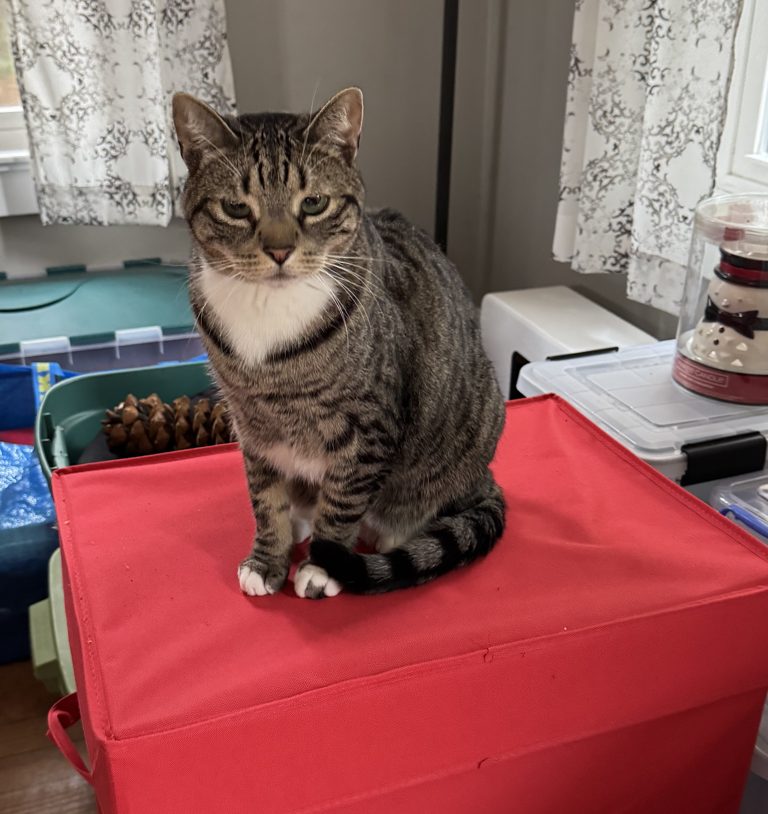
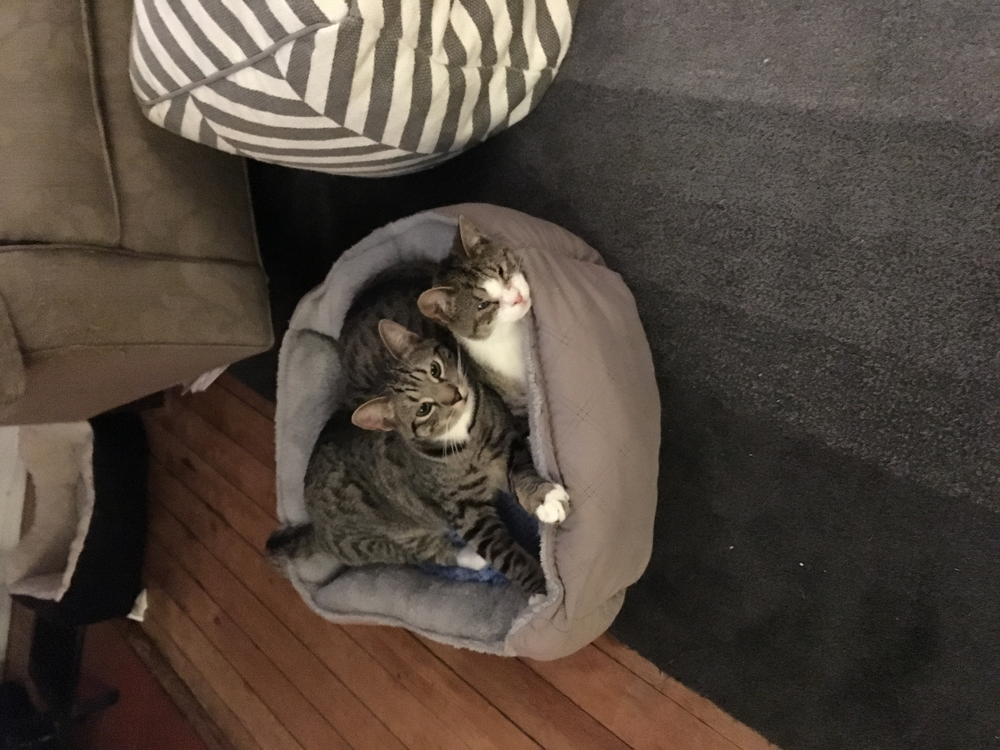

_This is my submission for the February, 2025 [IndieWeb Carnival](https://indieweb.org/IndieWeb_Carnival), hosted by [Joe Crawford](https://artlung.com/affirmations-ic/). The theme is "Affirmations." You shoud submit something!_

First things first: self-affirmation is not my thing. My internal monologue is a condemnation.

"You aren't ..."

"You didn't ..."

"You should have ..."

It's been this way as long as I can remember, but it's starting to change. The change started in an instant, but we're going to take the long way to get there.

This is Cooper.

We adopted Cooper and his brother, Cole (bonus points if you know the significance of the names) in December of 2017 from Trenton Cat Rescue in New Jersey. Cole had a condition that caused his eyelashes to grow inward and scratch his corneas. When the rescue found them, Cole could hardly see. Cooper was his guardian. Cole needed surgery to remove his outer eyelids (cats have inner and outer eyelids, which I never knew until these two). After that, his eyes stopped hurting and his vision improved, but his peripheral vision has always been bad and he's always been skittish.

Cooper never stopped protecting Cole. For years, they were inseparable. In any room, Cole would position himself behind Cooper relative to the entrance. Sometimes when we were sitting downstairs, Cooper would come down and scout out the room. Then he'd go upstairs and a few minutes later he'd come back down with Cole. I've never seen anything like that in a cat. Over time, Cole has grown more comfortable and independent, but Cooper was always big brother.

Here's a representative Cooper and Cole pose from 2018.

Cooper also loved people. LOVED people. He would come striding into a room full of strangers and check out every lap in the place. Rub up against every leg. If you picked him up he'd give you a "kitty hug" by wrapping his front legs around your neck. He especially loved me. Whenever I sat down, he'd come over to sit on my lap or sit next to me. He was a big, bold sweetheart and he was always looking out for his brother or showering the people around him with affection.

The attentive reader will have noticed that I'm writing in the past tense. On January 19, 2025, out of nowhere, he started spitting up repeatedly and was very sluggish. It was worrying enough that I took him to the emergency vet. I was worried he'd swallowed something and would need an operation to remove it. Instead, he never came home.

They found that he was riddled with cancer. It had probably been progressing for years, but even if we'd known, there wasn't anything we could have done. All those years he was looking out for his brother, when he was the sick one the whole time. I went back so I could say goodbye and be with him so he wouldn't be alone at the end. He deserved at least that.

So what does all this have to do with affirmation? Well, after Cooper was gone, that inner monologue kicked into high gear. The night before I took him to the vet, he came over to sit on my lap. I'd just recently discovered the indieweb, so I was typing away on my laptop. I paid him scant attention and he walked off my lap and sat next to me instead. I fixated on that moment when he wanted to sit on my lap and I was more focused on my laptop. Within a few days, I'd convinced myself that I'd been neglectful and left him starved for attention and affection for his entire life.

A week or so later, I was taking the train into New York City for work. I was looking out the window, beating myself up for being a bad cat dad, when out of nowhere I thought "Stop telling yourself lies about yourself." I don't think that sort of thing. It felt like it came from outside of me. And when I thought it ... I smelled Cooper.

I am not a person of faith. But I am convinced that Cooper had had enough of my wallowing and decided it was time to snap me out of it. Human history is riddled with stories of visions and visitations. The locales often inspire wonder: Lourdes, Guadalupe, Fátima. I had mine on the Northeast Corridor NJ Transit line somewhere a little south of Newark. I'll take it.

So now, I start every day by repeating Cooper's mantra: "Stop telling yourself lies about yourself." Stories have power - especially the stories we tell ourselves. When you lie to yourself, you start to believe those lies. After decades of berating myself, I see myself in caricature, and it's not a particularly pleasant one.

What Cooper left me is more an admonition than an affirmation, but it's helping me to chip away at that caricature. And I get to start every day with a reminder that my buddy's out there looking out for me just like he used to do for Cole. That's pretty affirming.